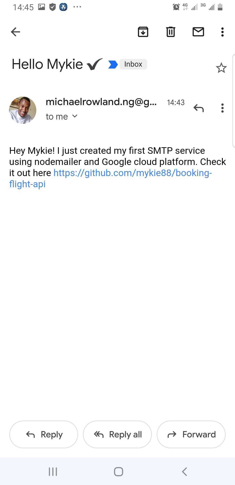

# Booking Flight Api

A mock api for performing CRUD operations for flight booking

## Technologies

NodeJS, Express, Nodemailer

## Description of SMTP Feature

* An SMTP feature was added using the `nodemailer` package

* Nodemailer was installed by running `npm install nodemailer` in the project folder

    *N.B.: NodeJS and Express were already previously installed for this project*

* A mailSender function was then created in the index.js file to handle the nodemailer transporter

* An OAuth2 Gmail service was setup on Google cloud platform and the clientID, clientSecret and refreshtoken were collected to setup the auth for the nodemailer transporter

* All auth credentials were saved in a .env file and accessed using the process.env function of dotenv node package

* Using the sendmail method of the nodemailer transporter, a simple message was sent as text to a recipient from my authorized testuser account.

## Screenshots 

